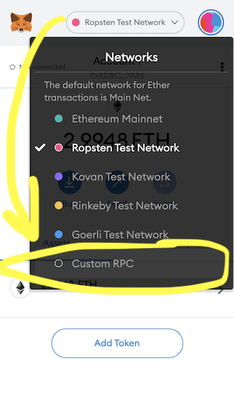
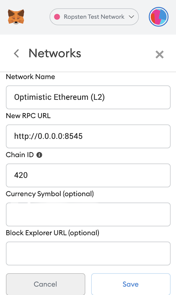
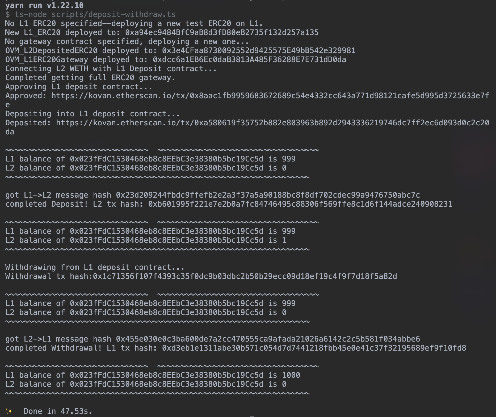

# {{ $frontmatter.title }}

::: tip Work in Progress™
_Our documentation is a rapidly improving work in progress. If you have questions or feel like something is missing feel free to ask in our [Discord server](https://discord.gg/5TaAXGn2D8) where we (and our awesome community) are actively responding, or [open an issue](https://github.com/ethereum-optimism/community-hub/issues) in the GitHub repo for this site._
:::

## Introduction

Hello and welcome!  
If you're looking to find out what it takes to get your dApp up and running on layer 2, then you've come to the right place!  
This document will serve as a reference to take you through the stages of integrating.

*Note: if at any time in this process you get stuck or have questions, please reach out on [discord](https://discord.gg/5TaAXGn2D8)!  We just ask that you do this in the public `#tech-support` channel so that others may learn alongside us.* :)

## Buidling Overview

There are two main steps to get a dapp running on Optimistic Ethereum:

1. **Compile and test your contracts:** get your existing contract tests running on a local version of Optimistic Ethereum via [truffle](https://www.trufflesuite.com/), [hardhat](https://hardhat.org), or your preferred Ethereum testing framework.
2. **Deploy your contracts to Optimistic Ethereum:** run those cheap a$$ transactions for real!

You might also want to take the following two steps depending on your specific needs:

1. **(Optional) Deploy and test against L2 Geth:** get those contracts running on a local instance of the full L2 system with our modified version of [go-ethereum](https://github.com/ethereum-optimism/go-ethereum).
2. **(Optional) Create bridges between L1 and L2:** get L1 and L2 communicating where necessary, such as adding deposits/withdrawals.

## Compiling and Testing Contracts

### Setup and Resources

::: tip Required Tooling
* [`@eth-optimism/hardhat-ovn`](https://www.npmjs.com/package/@eth-optimism/) 
* [`hardhat`](https://hardhat.org/getting-started/)

Since your OVM-compatible contracts require Optimism's custom Solidity compiler, you'll be using Optimism's `@eth-optimism/hardhat-ovm` package.
This package makes it easy to compile contracts and deploy them to an Optimistic Ethereum network.

Currently, We're focusing most of our internal development efforts on our [`hardhat`](https://hardhat.org/) tooling.
However, we are still attempting to provide continued support for other development frameworks like [`truffle`](https://www.trufflesuite.com/).
If any of our plugins are giving you issues, please ping us in our [#tech-support channel](https://discord.gg/NypkmfSkkw) in our discord server and we can help out!
:::

The first part of getting started with Optimistic Ethereum is to get your contracts up and running on a local L2 node.
This process involves two primary sub-steps:

1. Compile your contracts with the OVM Solidity compiler.
2. Deploy and test your contracts onto the local L2 node using our [`optimism`](https://github.com/ethereum-optimism/optimism#integration-tests) monorepo.

If you're using [hardhat](https://hardhat.org), our preferred development environment, this can be done with the use of a handy plugin we've built.
For the rest of this documentation, we'll expect you to have your Solidity contracts ready to go.
Please note that Vyper support is currently not enabled but is planned for a future release.

If you want to try out an example contract instead of deploying your own, you can follow our [tutorial](https://github.com/ethereum-optimism/optimism-tutorial) which should be pretty seamless.
If you're using another testing suite like [truffle](https://www.trufflesuite.com/), that tutorial won't apply. But these `npm` packages have got you covered:

- [`@eth-optimism/solc`](https://www.npmjs.com/package/@eth-optimism/solc): exports the Optimistic Ethereum compiler for `solidity@0.5/0.6/0.7`
- [`@eth-optimism/hardhat-ovm`](https://www.npmjs.com/package/@eth-optimism/hardhat-ovm): exports `artifacts-ovm` folder of contract artifacts which will work with contracts output by the compiler.

<!-- UPDATE ONCE WAFFLE EXAMPLE IS UPDATED -->
An example of usage with [waffle](https://getwaffle.io) can be found in [this great tutorial](https://github.com/ScopeLift/ovm-uniswap-v2-core#porting-solidity-contracts-to-optimism-a-guide-using-uniswap-v2) by [Scopelift](https://www.scopelift.co/) which walks through getting Uniswap V2 ported over.
If you are using [truffle](https://www.trufflesuite.com/), [here is an example repository](https://github.com/ethereum-optimism/Truffle-ERC20-Example) which walks through how to start using Optimistic Ethereum with Truffle and a simple ERC-20.

We recommend preserving EVM functionality when doing your port.
For example, you might want to add separate `test:evm` and `test:ovm` scripts to your `package.json` that use different `truffle-config.js` and `truffle-config-ovm.js` configuration files.
**It's very important to make sure that all of your contract tests work in the EVM first before debugging the OVM.**
Sometimes it looks like the OVM has a bug, when really it's just an error in your contracts.

### Troubleshooting

There are some small differences between the EVM and the OVM which could require some debugging at this stage.
For help with these, you can check out the following resources:

1. [High level overview](https://hackmd.io/elr0znYORiOMSTtfPJVAaA) of differences.
2. [Complete EVM/OVM comparison](/docs/protocol/evm-comparison) of all discrepancies.
3. [Scopelift Uniswap tutorial](https://github.com/ScopeLift/ovm-uniswap-v2-core#porting-solidity-contracts-to-optimism-a-guide-using-uniswap-v2), which has some great "OVM vs. EVM" sections.

Next we're going to get your contracts deployed to a real Optimistic Ethereum node (running on our [fork of go-ethereum](https://github.com/ethereum-optimism/go-ethereum)).

### Local Deployment

Before deploying to a "real" network, like a testnet or mainnet, you may want to deploy to a local version of our `go-ethereum` fork.
If your contracts are relatively simple you may not need to do this.
However, if you plan to write contracts that communicate between L1 and L2, then we highly recommend reading this section.

#### Using the `optimism` Repo

The [`optimism`](https://github.com/ethereum-optimism/optimism) monorepo provides you with the docker containers needed to spin up your own local Optimistic Ethereum network.
We use [docker](https://www.docker.com/) to standardize our development experience, so please make sure you've [installed docker](https://www.docker.com/products/docker-desktop) and that the docker service is running before you continue.
You can check out the [tool's full usage page](https://github.com/ethereum-optimism/optimism#quickstart) for a "Quickstart" guide.

Run the following commands to get set up:

```shell
git clone git@github.com:ethereum-optimism/optimism.git
cd optimism
yarn install
yarn build
cd ops
docker-compose build
docker-compose up
```

And that's it!
You now have an L2 chain at `http://0.0.0.0:8545` connected to an L1 chain at `http://0.0.0.0:9545`.

### Setting up a custom network in MetaMask (Optional)

With the L2 node and L1 nodes running locally, you can use their respective RPC URLs for testing!
If you use MetaMask, what you could do next is create a custom RPC network so that you can easily deploy and interact with your contracts using MetaMask!

Here's a step-by-step process on how to do that while in your browser:

1. Open MetaMask the browser extension and click on your currently connected network at the top pane, next to your jazzicon.
2. You'll see a modal open up with list of networks. Click on the "Custom RPC" button at the very bottom. (See example image below.)



3. Next, you'll enter in the network parameters. Enter `Optimistic Ethereum (Local L2)` for the network name, `http://0.0.0.0:8545` for the RPC URL, and `420` for the chain ID -- additionally, you can also set the currency symbol to `ETH`, but that's not entirely necessary since the use of ETH is implicitly understood:



4. Click save! And, you're done! 🙌 😎. You'll then see something like the image below when you click on your new `Optimistic Ethereum (Local L2)` network!


Adding the currency symbol is _optional_.

**L1 Custom Network (Optional)**

In addition to adding the L2 chain as a custom network, we can also add our local instance of the L1 chain from `optimism`.
To do this, you would go through the same steps as above, but instead enter in the following for the network parameters:
|     Param                    |                Value               |
| ---------------------------- | :--------------------------------: |
| Network Name                 |  `Optimistic Ethereum (Local L1)`  |
| New RPC URL                  |      `http://0.0.0.0:9545`         |
| Chain ID                     |        `31337`                     |
| (_OPTIONAL_) Currency Symbol |        `ETH`                       |

However, you'll likely mostly be using the L2 chain for most of your contract and deployment tests.
So, we'd advise just adding the L2 custom network, unless you think you really need the local custom L1 chain network.

Later, when you decide to move on to testing on Optimism's Kovan testnet, the simple change you'd make is just replacing the RPC URL with the RPC URL for Optimism's Kovan testnet.

#### Deploying contracts (locally)

Coming in the next several days!!

## Common Gotchas

::: tip Need help?
We're doing our best to keep this section updated as common issues come and go.
If none of the tips here work for you, please report an issue on [discord](https://discord.gg/5TaAXGn2D8).
:::

People tend to run into a few common issues when first interacting with Optimistic Ethereum.
Here's a checklist to run through if you're having any problems.

### Retrieve contract revert reason

In your Ethereum contract tests, a common test that developers write is for revert reasons.
For example, let's say you have a yield farming contract that has a `require` statement on its `withdraw` method to check whether the caller already has a deposit (that has also been accruing interest!).
If the caller does _not_ have a pre-existing deposit, then your `withdraw` method reverts with a message saying, `"There is nothing for you to withdraw!"`.
This message is what we would like to test for.
However, in Optimistic Ethereum, this is not as straightforward as using something like `hardhat`'s `.to.be.reverted` or `.to.be.revertedWith` testing methods:

```js
// THIS WILL NOT WORK FOR OVM TESTS
await expect(withdrawTx).to.be.revertedWith(
  "There is nothing for you to withdraw!"
)
```

Simply using this syntax will not work to retrieve your revert reason for your contract.

Instead, when writing tests for Optimistic Ethereum, you will need a clever way to retrieve these revert reasons.
Fortunately, to retrieve revert reasons for contract calls in the Optimistic Ethereum Virtual Machine (OVM), our friends at [Synthetix](https://www.synthetix.io/) created a utility script called [`revertOptimism.js`](https://github.com/Synthetixio/synthetix/blob/develop/test/optimism/utils/revertOptimism.js).
We suggest borrowing code from this script, and are working on our own libraries to make this easier.

The main component to focus on in Synthetix's script is the [`assertRevertOptimism` method](https://github.com/Synthetixio/synthetix/blob/develop/test/optimism/utils/revertOptimism.js#L37) that helps to retrieve the revert reason from the transaction of our contract call in our test.

### `block.timestamp` and `block.number` in L2

::: warning These values will soon be updated
We are working on updating `block.timestamp` and `block.number` so that instead of a delay in the values that are returned, they will return the _current_ `block.number` and current `block.timestamp`.
:::

Queries to `block.number` are _slightly_ different than `block.number` in Ethereum.
These queries return the `block.number` of the previous block.
Note that there is no such thing as a "block" in Optimistic Ethereum as blocks in Ethereum.
A block on Optimistic Ethereum is merely a block of just 1 transaction, where these blocks made up of single transactions are ordered by sequencers in the network.

Queries to `block.timestamp` are _mostly_ different than `block.timestamp` in Ethereum.
These queries are updated every time a new deposit is submitted and return timestamps from roughly 5 to 10 minutes ago.

### Invalid chain ID

The default chain ID of the local L2 chain is `420`.
If you're getting an error when sending transactions, please make sure that you are using the right chain ID.

### Local node does not charge fees

At the moment, the node created by starting the docker containers under `optimism/ops` does not charge the user for any fees.
You can send successfully transactions by setting `gasPrice` to `0` in your configs and in contract calls.

### Constantly exceeding gas limit

Because of some technical details about rollups, the maximum gas limit of each transaction is always a bit less than on mainnet.

### Still seeing the same bug after a patch or new release

We frequently update our software and corresponding docker images.
Make sure to periodically download the latest code by running the following in your project.

```sh
git clone git@github.com:ethereum-optimism/optimism.git
cd optimism
yarn
yarn build
cd ops
docker-compose build
```

### Gas used appears to be exceeding gas limit

All L2 transactions are technically meta transactions sent by the sequencer.
This means that `receipt.gasUsed` may be higher than the `tx.gasLimit`, and is currently an underestimate by about 20%.
This will be fixed in an upcoming release.

### Contract deployment appears to fail for no reason

Make sure you're compiling with the Optimistic Ethereum version of the Solidity compiler.
Contract deployments will usually fail if you compile using the standard Solidity compiler.

### Revert reasons are not returned on `eth_sendRawTransaction` calls

When `geth` was forked for Optimistic Ethereum, the `geth` had not yet started returning revert reasons for `eth_sendRawTransaction`s.
Thus, if you want to retrieve a revert reason for a failing L2 transaction on `eth_sendRawTransaction` calls, you will need to make an `eth_call`.
For example, [here](https://github.com/Synthetixio/synthetix/blob/develop/test/optimism/utils/revertOptimism.js) is how Synthetix retrieves the revert reason for contract calls in the OVM.

### Testnet Deployment

You probably want to deploy to testnet before heading over to mainnet (good idea, tbh).
Our primary L2 testnet is currently deployed on top of Ethereum's [Kovan](https://kovan.etherscan.io) network.
We sometimes run other testnets too.
Here's a current list of our testnet endpoints (will be updated when things change):

| L1 Network                          | L2 Network | HTTP Endpoint                                          | Websocket Endpoint                                               |
| ----------------------------------- | ---------- | ------------------------------------------------------ | ---------------------------------------------------------------- |
| [Kovan](https://kovan.etherscan.io) | OE Kovan 1 | [https://kovan.optimism.io](https://kovan.optimism.io) | [https://kovan.optimism.io:8546](https://kovan.optimism.io:8546) |

## Bridging L1 and L2

::: tip Work in Progress™
This section is still a work in progress.
Cross-chain communication is one of the most complex (but also coolest) parts of our system.
Thank you for your patience while we get all of this documentation out. ❤️
:::

Apps on Optimistic Ethereum are extra cool because they can, if necessary, interact with smart contracts sitting on Ethereum.
We provide a standard message-passing interface for sending data between L1 and L2 to make this as easy as possible.
If you don't think you'll be sending information between layers, you probably don't need to read through this section.

Documentation for arbitrary message passing is a Work In Progress™, but all features do already work.
In the meantime, you may be interested in taking a look at the Synthetix Bridge contracts.
These contracts are pretty cool and make heavy use of our L1⇔L2 messaging infrastructure:

1. Depositing SNX into L2
    - [Initiating a deposit on L1](https://github.com/Synthetixio/synthetix/blob/master/contracts/SynthetixBridgeToOptimism.sol#L190-L205)
    - [Which leads to receiving a balance on L2](https://github.com/Synthetixio/synthetix/blob/master/contracts/SynthetixBridgeToBase.sol#L111-L115)
2. Migrate SNX Escrow entries to L2 (transferring large amounts of state from L1->L2):
    - [Initiating a migration on L1](https://github.com/Synthetixio/synthetix/blob/master/contracts/SynthetixBridgeToOptimism.sol#L207-L236)
    - [Which leads to receiving escrow entries on L2](https://github.com/Synthetixio/synthetix/blob/master/contracts/SynthetixBridgeToBase.sol#L98-L108)
3. Withdrawing SNX to L1:
    - [Burning L2 SNX and initiating the withdrawal on L2](https://github.com/Synthetixio/synthetix/blob/master/contracts/SynthetixBridgeToBase.sol#L76-L94)
    - [Completing the withdrawal and receiving a balance on L1](https://github.com/Synthetixio/synthetix/blob/master/contracts/SynthetixBridgeToOptimism.sol#L126-L136)

### ☎️ L1 <> L2 Communication

::: tip Work in Progress™
This section is also an WIP, but we are quickly working to improve it! If you think that something is unclear, we recommend looking through the OVM's `messaging` contracts for a granular view of this L1 <> L2 communication.
As always, feel free to reach out to us on discord with questions 🤗:

📎 OVM's `messaging` contracts:`
* 📜 [`Abs_BaseCrossDomainMessenger.sol`](https://github.com/ethereum-optimism/optimism/blob/master/packages/contracts/contracts/optimistic-ethereum/OVM/bridge/messaging/Abs_BaseCrossDomainMessenger.sol)
* 📜 [`OVM_L1CrossDomainMessenger.sol`](https://github.com/ethereum-optimism/optimism/blob/master/packages/contracts/contracts/optimistic-ethereum/OVM/bridge/messaging/OVM_L1CrossDomainMessenger.sol)
* 📜 [`OVM_L1MultiMessageRelayer.sol`](https://github.com/ethereum-optimism/optimism/blob/master/packages/contracts/contracts/optimistic-ethereum/OVM/bridge/messaging/OVM_L1MultiMessageRelayer.sol)
* 📜 [`OVM_L2CrossDomainMessenger`](https://github.com/ethereum-optimism/optimism/blob/master/packages/contracts/contracts/optimistic-ethereum/OVM/bridge/messaging/OVM_L2CrossDomainMessenger.sol)
:::

The following is an abridged version of the section titled "L1 to L2 interoperability" in [_How does Optimism's Rollup really work?_](https://research.paradigm.xyz/optimism) by [Georgios Konstantopoulos](https://twitter.com/gakonst) from Paradigm Research.

---------

Optimistic Ethereum allows asynchronous calls between L1 and L2 users or contracts.
Practically, this means that a contract on L1 can make a call to a contract on L2, and vice versa.
This contract communication is implemented by deploying "messenger" contracts on both Ethereum and Optimistic Ethereum.

The sending chain's contract calls `sendMessage` with the data it wants to pass over, and a relay calls `relayMessage` (from L1 or from L2) on the receiving chain to actually relay the data.

These methods are shown below for reference:

* (L1 or L2 Sender ) [`sendMessage`](https://github.com/ethereum-optimism/optimism/blob/master/packages/contracts/contracts/optimistic-ethereum/OVM/bridge/messaging/Abs_BaseCrossDomainMessenger.sol#L51-L61) of `Abs_BaseCrossDomainMessenger.sol`:

```solidity
/**
 * Sends a cross domain message to the target messenger.
 * @param _target Target contract address.
 * @param _message Message to send to the target.
 * @param _gasLimit Gas limit for the provided message.
 */
function sendMessage(
    address _target,
    bytes memory _message,
    uint32 _gasLimit
)
    override
    public
{
    bytes memory xDomainCalldata = _getXDomainCalldata(
        _target,
        msg.sender,
        _message,
        messageNonce
    );

    messageNonce += 1;
    sentMessages[keccak256(xDomainCalldata)] = true;

    _sendXDomainMessage(xDomainCalldata, _gasLimit);
    emit SentMessage(xDomainCalldata);
}
```

2. (L1 Receiver) [`relayMessage`](https://github.com/ethereum-optimism/optimism/blob/master/packages/contracts/contracts/optimistic-ethereum/OVM/bridge/messaging/OVM_L1CrossDomainMessenger.sol#L79-L89) of  `OVM_L1CrossDomainMessenger.sol`:
```solidity
/**
 * Relays a cross domain message to a contract.
 */
function relayMessage(
    address _target,
    address _sender,
    bytes memory _message,
    uint256 _messageNonce,
    L2MessageInclusionProof memory _proof
)
```

3. (L2 Receiver) [`relayMessage`](https://github.com/ethereum-optimism/optimism/blob/master/packages/contracts/contracts/optimistic-ethereum/OVM/bridge/messaging/OVM_L2CrossDomainMessenger.sol#L45-L54) of `OVM_L2CrossDomainMessenger.sol`:
```solidity
/**
 * Relays a cross domain message to a contract.
 */
function relayMessage(
    address _target,
    address _sender,
    bytes memory _message,
    uint256 _messageNonce
)
```

Conveniently, all transactions from L1 to L2 get automatically relayed _by the sequencer_.
This happens because the L1 ➡️ L2 bridge calls [`enqueue`](https://github.com/ethereum-optimism/optimism/blob/master/packages/contracts/contracts/optimistic-ethereum/OVM/bridge/messaging/OVM_L1CrossDomainMessenger.sol#L287-L291), queuing up a transaction for execution by the sequencer.

From these calls to `enqueue`, we can, in a way, think of the the sequencer is an "always on" relay for L1 to L2 transactions, while L2 to L1 transactions need to be explicitly relayed by users.

Using the default bridge contracts by Optimism requires all L2 to L1 transactions are at least [1 week old](https://community.optimism.io/faqs/#why-is-there-a-delay-when-moving-assets-from-optimistic-ethereum-to-ethereum).
This is to allow enough time for verifiers to submit fraud proofs and prevent invalid withdrawals.

It could be the case that developers deploy their own bridge contracts with semi-trusted mechanisms that allow L2 to L1 transactions with a smaller time restriction.

As a developer integrating with Optimism's messengers is very easy.
Just call `<LAYER>CrossDomainMessenger.sendMessage` with the calldata, gasLimit and target address you want to call on the destination layer.  

This wraps the message in a [`relayMessage`](https://github.com/ethereum-optimism/optimism/blob/master/packages/contracts/contracts/optimistic-ethereum/OVM/bridge/messaging/Abs_BaseCrossDomainMessenger.sol#L83-L96) call, targeting the `L2CrossDomainMessenger`.
That's all! It's the same general process for L2 to L1.
(This is enabled by the `L1MessageSender`, `L1BlockNumber`, and `L1Queue` fields in the message and transaction `meta`.)

### Example use case for L1 <> L2 communication

Say that you wanted to send a gift of an _ERC721 token_ (NFT) for your friend to withdraw on L2.
When your friend makes the withdrawal on L2, you also want to _relay a message_ to your friend that notifies them to deposit their tokens to an L2 loan provider (e.g. Loans4NFTs) to unlock an additional feature of the gifted NFT.

However, to initiate a deposit of this NFT token to Loans4NFTs, you first need to get this NFT on L1.
So, you initiate a deposit of your NFT to an ERC721 gateway contract (you can think of this deposit as "locking in your token as collateral" to L1) and whitelist your friend's wallet address so that your friend can mint and withdraw the gifted NFT on L2.
Now that the NFT has been deposited on L1, it can now be withdrawn and claimed by your friend on L2 -- assuming that you include a `require` statement to check that the withdrawer is your friend's address.
For your friend to mint this NFT, he would have to initiate a withdrawal transaction from the address that you whitelisted in the deposit transaction.
Assume your friend successfully uses the correct address to withdraw and claim his NFT that you gifted him.
He then receives a relayed message from L1 that reads, "Hey fren! I left you a surprise for when you deposit your NFT to Loan4NFTs :)".
And, when your friend deposits their NFT to Loans4NFTs, he receives an additional yield farming reward for the first 30 days while keeping his NFT locked with Loan4NFTs.

#### Best practices

The example shown above is to illustrate _just one_ ideal use case for L1 <> L2 communication, but there are a myriad of possible use cases!
However, since this cross-layer message passing is _asynchronous_, we suggest that it be used mainly for communicating additional information _asynchronously_ from one chain to the next.

Whether that's for notifying your user of:

* A special new gift on the receiving chain,
* A timestamp of when their withdrawn L2 tokens are ready to be staked at a desired protocol on the receiving chain,
* A list of compatible exchanges or protocols that their token can be used on,
* Unique rewards or promotions that can be claimed on specific protocols on the receiving chain,

these messages should serve as a helpful nudge to your users where there otherwise would be absent communication between your user's action and the action that you desire your users to make when withdrawing their tokens on L2.

### 🌉 ETH and Token Bridges

Just like on L1, gas fees (i.e. transaction fees on Ethereum, usually denominated in [Gwei](https://gwei.io/)) still apply on L2.
That means that you need to deposit some ether (ETH) to L2 to be able to pay for these gas fees.
However, you cannot just directly transfer your ETH from an L1 smart contract or EOA (i.e. wallet) to Optimistic Ethereum's L2.

This is where the ETH (and token) bridges come in!

#### The Standard™️ ETH Bridge

Optimistic Ethereum comes with a standard ETH bridge, [`OVM_L1ETHGateway.sol`](https://github.com/ethereum-optimism/optimism/blob/master/packages/contracts/contracts/optimistic-ethereum/OVM/bridge/tokens/OVM_L1ETHGateway.sol). This smart contract acts as a _bridge_ between L1 and L2, letting users deposit ETH into the contract on L1 so that it can be used on L2.

`OVM_L1ETHGateway` has 2 important methods to keep in mind:

1. [`deposit()`](https://github.com/ethereum-optimism/optimism/blob/master/packages/contracts/contracts/optimistic-ethereum/OVM/bridge/tokens/OVM_L1ETHGateway.sol#L81) is external and payable method used to send ETH from an account on L1 to the same address on L2.
2. [`depositTo()`](https://github.com/ethereum-optimism/optimism/blob/master/packages/contracts/contracts/optimistic-ethereum/OVM/bridge/tokens/OVM_L1ETHGateway.sol#L93) is external and payable method used to send ETH to another address on L2.

Here's an example deposit flow from L1 to L2 using the `depositTo()` method:


Similarly, here's an example of the flow in reverse, starting with a deposit of ETH on L2 and the funds being sent to the `msg.sender`'s address on L1. Here we use `withdraw()` or [`withdrawTo()`](https://github.com/ethereum-optimism/optimism/blob/fb362ff748c803dc9099326f0e3096889b5dd5aa/packages/contracts/contracts/optimistic-ethereum/OVM/bridge/tokens/Abs_L2DepositedToken.sol#L163), which `OVM_ETH.sol` inherits to initiate our transfer of ETH from L2 to L1:


#### Token Bridges

Similar to the ETH bridge, Optimistic Ethereum comes with bridge contracts that allow for _any_ token transfers between L1 and L2.

These contracts are:
1. [`Abs_L1TokenGateway.sol`](https://github.com/ethereum-optimism/contracts/blob/master/contracts/optimistic-ethereum/OVM/bridge/tokens/Abs_L1TokenGateway.sol)
2. [`Abs_L2DepositedToken`](https://github.com/ethereum-optimism/contracts/blob/master/contracts/optimistic-ethereum/OVM/bridge/tokens/Abs_L2DepositedToken.sol)
3. [`OVM_L1ERC20Gateway.sol`](https://github.com/ethereum-optimism/contracts/blob/master/contracts/optimistic-ethereum/OVM/bridge/tokens/OVM_L1ERC20Gateway.sol)
4. [`OVM_L2DepositedERC20.sol`](https://github.com/ethereum-optimism/contracts/blob/master/contracts/optimistic-ethereum/OVM/bridge/tokens/OVM_L2DepositedERC20.sol)

:::tip How-Tos WIP™️
Guides for how to use these contracts are fast approaching! But they are still WIPs. In the meantime, check out this deposit-withdraw guide below 😉.

As always, reach out to us on [discord](https://discord.gg/5TaAXGn2D8) with any questions, feedback, or issues you may have in these docs. We're here to help!
:::

Luckily for you, we made a simple example deposit-and-withdraw guide for how to use `Abs_L2DepositedToken.sol` on the [`deposit-withdraw`](https://github.com/ethereum-optimism/optimism-tutorial/tree/deposit-withdrawal) branch of the `optimism-tutorial` repo!
The exciting L2 code 😋 you've been waiting for can be found in `contracts/MyL2DepositedERC20.sol` of that branch, and if you run through the `README.md` to deploy your ERC20 contract to your local Optimistic Ethereum L2, you'll be able to see the message-passing system at work in the logs while making an L1 to L2 ERC20 deposit, and back again, with an L2 to L1 ERC20 deposit.
Those logs should look something like this, if you went through the steps correctly:



Doesn't that look absolutely beautiful 😍😍😍!! From here, you're off to the races and ready for testing on Kovan! 🎉
